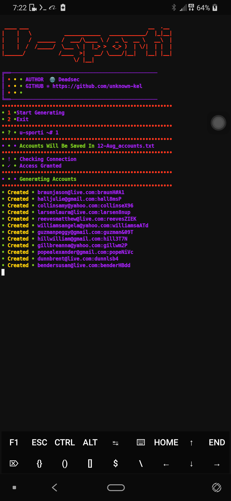

# U-sporti

### [+] Created By <a href="https://github.com/unknown-kel">unknown-kel</a>

### [+] Decription :
***Simple Script To Generate Unlimited Spotify Accounts.***

### [+] Installation

```apt install git python -y```

```git clone https://github.com/unknown-kel/u-sporti```

```cd u-sporti```

```bash install.sh```

```python3 sporti.py```


### Or, Use Single Command
```
apt install git python -y && git clone https://github.com/unknown-kel/u-sporti && cd u-sporti && bash install.sh && python3 sporti.py
```

## Screenshots:




## This repository is open source to help others. So if you wish to copy, consider giving credit!
